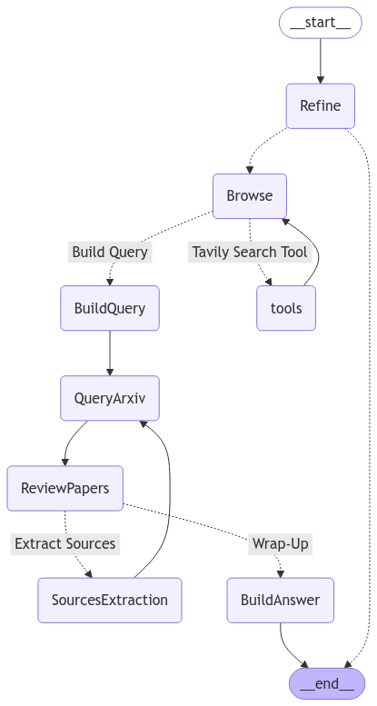

# AIrXiv

## Overview

**AIrXiv** is an intelligent agent designed to streamline the research paper discovery process. By leveraging conversational refinement, intelligent web browsing, and API querying, AIrXiv assists researchers in finding the most relevant papers from arXiv and related sources.

## Key Features

- **Interactive Query Refinement:** Chat with an AI assistant to clarify and refine your research intent.
- **Web Context Integration:** Utilize Tavily Search to gather recent breakthroughs, state-of-the-art findings, and contextual insights.
- **Intelligent Search Query Generation:** Automatically build optimized search queries based on user interaction and browsing results.
- **arXiv API Integration:** Retrieve and assess research papers directly from arXiv.
- **Relevance Assessment:** Automatically evaluate paper relevance based on title, abstract, and methodology.
- **Source Extraction:** Identify additional references cited in relevant papers.
- **Final Recommendations:** Present a curated list of highly relevant papers.

## Workflow

1. **Refinement Phase:** Interact with the chatbot to clarify and refine your research question.
2. **Browsing Phase:** The agent browses the web to add context and expand the search scope.
3. **Search Query Generation:** Build a structured `SearchQuery` object including goal, queries, and timeframes.
4. **arXiv Query:** Fetch papers using the arXiv API based on the generated search query.
5. **Paper Review:** Assess relevance based on pre-defined criteria.
6. **Source Extraction:** Analyze PDFs of relevant papers to extract further references.
7. **Final Report:** Present the final set of relevant papers with summaries and links.

## Installation

### Prerequisites

- Python 3.9+
- Required Python libraries:
  ```bash
  pip install -r requirements.txt
  ```
- API keys for OpenAI and Tavily Search (stored in `.env`).

### Environment Setup

Create a `.env` file:

```env
OPENAI_API_KEY=your_openai_api_key
TAVILY_API_KEY=your_tavily_api_key
OPENAI_MODEL=gpt-4o-mini
```

### Run the Agent

Start the agent using:

```bash
python app.py
```

## Usage

1. Launch the agent.
2. Refine your research query through conversation.
3. Let the agent browse the web and generate search queries.
4. Review the curated set of papers.
5. Receive a detailed report with titles, summaries, and links.

## Demo

## Agent Workflow Diagram

Below is a representation of the AIrXiv workflow:


## License

This project is licensed under the MIT License.
